```{r setup, include=FALSE, warning=FALSE, message=FALSE, error=FALSE}
knitr::opts_chunk$set(
  echo = FALSE,
  fig.width=8, fig.height=3.8,
  fig.align="center",
  dpi=120
)

library(dplyr)
library(tidyr)
library(ggplot2)
```


## Overview

- Why bother?
- What is Data Science?
- What are Data Scientists?
- What is Machine Learning?
- What types of problems can Machine Learning solve?
- AI &ne; Machine Learning?
- How does Machine Learning work?


## Why bother?

```{r}

d_search <- read.csv(
  "assets/material/search-ml-ds.csv", 
  col.names = c("month", "data science", "machine learning"),
  stringsAsFactors = FALSE, skip = 2, check.names = FALSE)

d_search %>%
  mutate(date = as.Date(paste0(month, "-01"))) %>% 
  gather(term, index, -date, -month) %>% 
  tbl_df() %>% 
  ggplot(aes(x = date, y = index, color = term)) +
  geom_line(size = 1) +
  theme_minimal() +
  theme(legend.position = "bottom", legend.direction = "horizontal", axis.text.y = element_blank()) +
  labs(
    x = "", y = "", color = "",
    title = "Google search trends",
    subtitle = "Exponential increase of interest in 'machine learning' and 'data science' over last 10 years",
    caption = "[source: trends.google.com]"
  )
```


## Google searches for "Machine Learning" 
<div style="text-align:center">
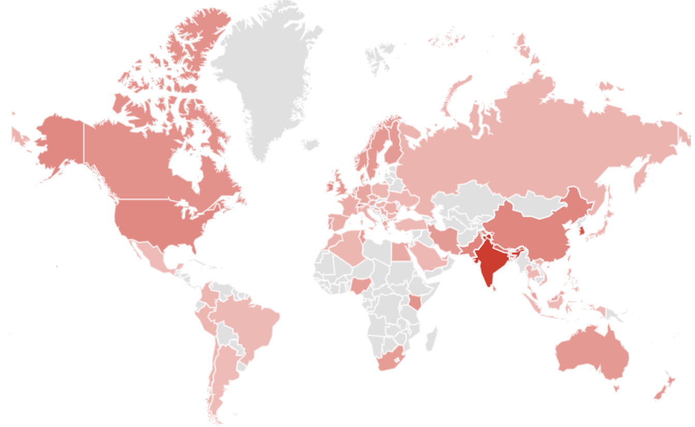
</div>

<div style="width:100%; text-align:center; font-size: 0.6em">
[source: trends.google.com]
</div>


# What is Data Science?


## What is Data Science?

Data Science is an interdisciplinary field that uses scientific methods, 
processes, algorithms and systems to extract knowledge and insights from data 
in various forms, both structured and unstructured.

<div style="text-align: right; width:100%; font-size: 0.9em">[Source: Wikipedia]</div>


## What is Data Science?

<!-- interdisciplinary field -->

<span style="color: #CCCCCC">
Data science is an <span style="color:black">interdisciplinary field</span> that uses scientific methods, 
processes, algorithms and systems to extract knowledge and insights from data 
in various forms, both structured and unstructured.
</span>

<div style="text-align:center">
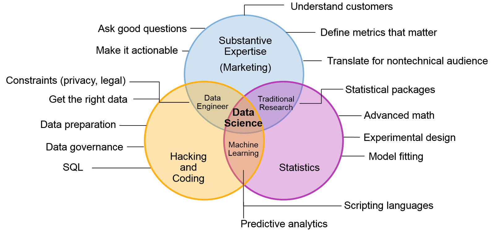
</div>

<div style="width:100%; text-align:center; font-size: 0.6em">
[source: gartner.com]
</div>


## What is Data Science?

<!-- scientific methods -->

<span style="color: #CCCCCC">
Data Science is an interdisciplinary field that uses <span style="color:black">scientific methods</span>, 
processes, algorithms and systems to extract knowledge and insights from data 
in various forms, both structured and unstructured.
</span>

<div style="text-align:center">
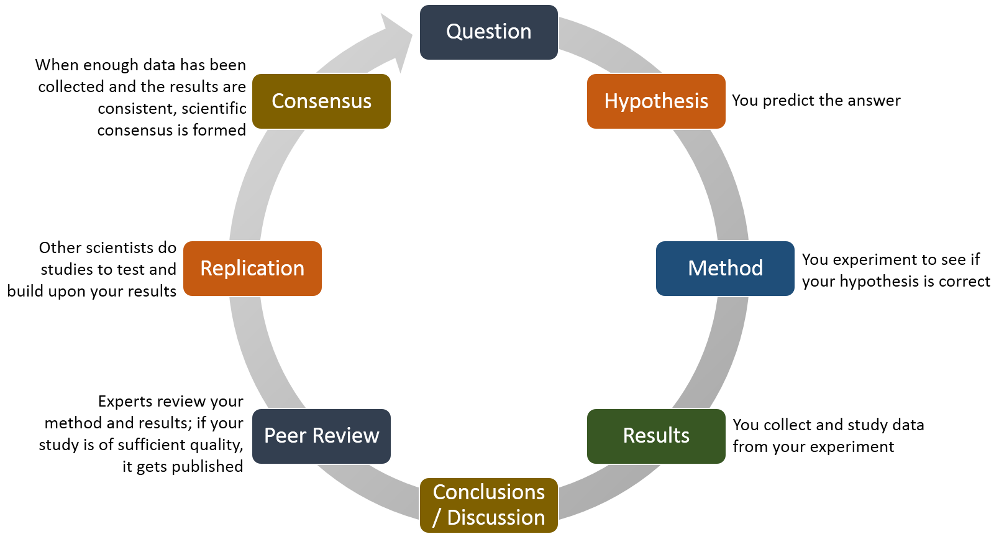
</div>

<div style="width:100%; text-align:center; font-size: 0.6em">
[source: fscj.edu]
</div>


## What is Data Science?

<!-- processes, algorithms and systems -->

<span style="color: #CCCCCC">
Data Science is an interdisciplinary field that uses scientific methods, 
<span style="color:black">processes, algorithms and systems</span> to extract knowledge and insights from data 
in various forms, both structured and unstructured.
</span>

<div style="text-align:center">
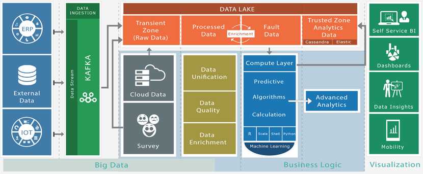
</div>

<div style="width:100%; text-align:center; font-size: 0.6em">
[source: bdbizviz.com]
</div>


## What is Data Science?

<!-- extract knowledge and insights -->
<span style="color: #CCCCCC">
Data Science is an interdisciplinary field that uses scientific methods, 
processes, algorithms and systems to <span style="color:black">extract knowledge and insights</span> from data
in various forms, both structured and unstructured.
</span>

<div style="text-align:center">
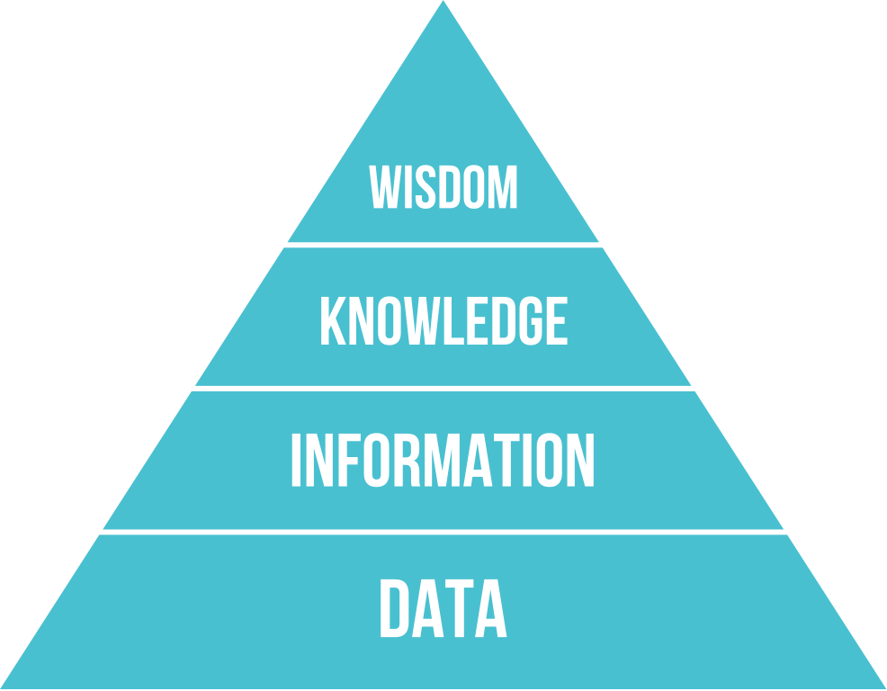
</div>

<div style="width:100%; text-align:center; font-size: 0.6em">
[source: wikipedia.org]
</div>


## What is Data Science?

<!-- structured and unstructured -->
<span style="color: #CCCCCC">
Data Science is an interdisciplinary field that uses scientific methods, 
processes, algorithms and systems to extract knowledge and insights from <span style="color:black">data 
in various forms, both structured and unstructured</span>.
</span>

<div style="text-align:center">
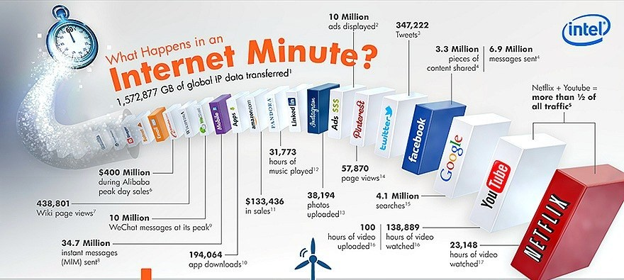
</div>

<div style="width:100%; text-align:center; font-size: 0.6em">
[source: carestruck.org]
</div>


# What are Data Scientists?


## Stats on Data Scientists

<div style="text-align:center">
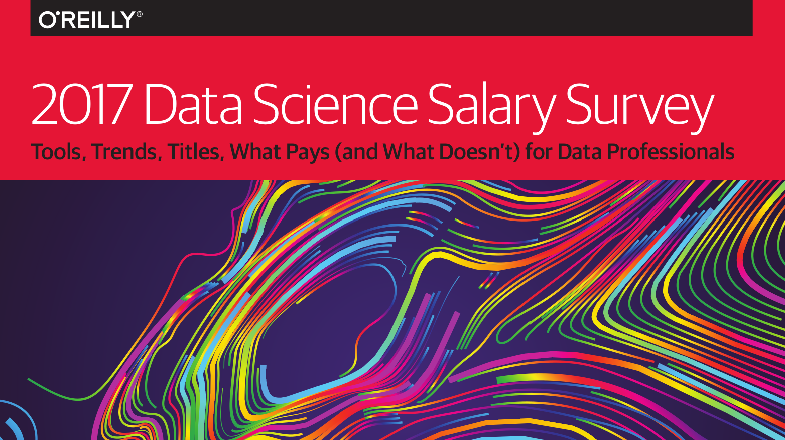
</div>

<div style="width:100%; text-align:center; font-size: 0.6em">
[www.oreilly.com/data/free/2017-data-science-salary-survey.csp]
</div>


## What industries do Data Scientists work in?

```{r fig.height=4}
d_industry <- read.csv("assets/material/salary-survey-industry.csv")

d_industry %>% 
  arrange(desc(share)) %>% 
  mutate(
    industry = tolower(industry),
    rank = seq(1, n()),
    top3 = ifelse(rank <=3, TRUE, FALSE)
  ) %>%
  ggplot(aes(x = reorder(industry, share), y = share)) +
  geom_col(aes(fill = top3), width = 0.85) +
  geom_text(aes(label = industry), hjust = 0, size = 3.5, nudge_y = 0.25) +
  geom_text(aes(label = paste0(share, "%")), hjust = 1, size = 3, nudge_y = -0.25, color = "white") +
  scale_y_continuous(limits = c(0, 24), expand = c(0, 0)) +
  scale_fill_manual(values = c("steelblue2", "magenta4")) +
  coord_flip() +
  theme_minimal() +
  # theme_void() +
  theme(axis.text = element_blank(), panel.grid = element_blank()) +
  guides(fill = FALSE) +
  labs(
    x = "", y = "",
    title = "Share of respondents by industry",
    subtitle = "Software, consulting, and banking/finance are top 3 industries in which Data Scientists work"
  )
```


## How do Data Scientists spent their time?

```{r}
d_timespent <- read.csv("assets/material/salary-survey-time-spent.csv")

d_timespent %>% 
  arrange(desc(share)) %>% 
  mutate(
    activity = tolower(activity),
    hours = tolower(hours),
    hours = factor(hours, c("none", "1–3 hours / week", "4–8 hours / week", "9–20 hours / week", "> 20 hours / week"))
  ) %>%
  group_by(activity) %>% 
  mutate(max_hour = share == max(share)) %>% 
  ggplot(aes(x = hours, y = share)) +
  geom_col(aes(fill = max_hour), width = 0.85) +
  facet_wrap(~activity, ncol = 2, scales = "free_x") +
  geom_text(aes(label = paste0(share, "%")), hjust = 1, size = 4, nudge_y = -1, color = "white") +
  scale_fill_manual(values = c("steelblue2", "magenta4")) +
  scale_y_continuous(expand = c(0.02, 0)) +
  coord_flip() +
  theme_minimal() +
  # theme_void() +
  theme(axis.text.x = element_blank(), panel.grid = element_blank(), strip.text = element_text(hjust = 0)) +
  guides(fill = FALSE) +
  labs(
    x = "", y = "",
    title = "Share of respondents spending time coding and in meetings",
    subtitle = "Most respondents are hands-on and spend half their time coding and less time in meetings"
  )
```


## What tasks do Data Scientists work on?

```{r fig.height=4}
d_tasks <- read.csv("assets/material/salary-survey-tasks.csv")

d_tasks %>% 
  arrange(desc(share)) %>% 
  mutate(
    top = ifelse(share > 50, TRUE, FALSE)
  ) %>%
  filter(share > 25) %>% 
  ggplot(aes(x = reorder(activity, share), y = share)) +
  geom_col(aes(fill = top), width = 0.85) +
  geom_text(aes(label = activity), hjust = 0, size = 3, nudge_y = 0.5) +
  geom_text(aes(label = paste0(share, "%")), hjust = 1, size = 3, nudge_y = -0.5, color = "white") +
  scale_y_continuous(limits = c(0, 100), expand = c(0, 0)) +
  scale_fill_manual(values = c("steelblue2", "magenta4")) +
  coord_flip() +
  theme_minimal() +
  # theme_void() +
  theme(axis.text = element_blank(), panel.grid = element_blank()) +
  guides(fill = FALSE) +
  labs(
    x = "", y = "",
    title = "Share of respondents working on tasks",
    subtitle = "Most time is spent on conducting data analyses, exploring and cleaning data and communicating results"
  )
```


## What education do Data Scientists have?

```{r}
d_education <- read.csv("assets/material/salary-survey-education.csv")

d_education %>% 
  arrange(desc(share)) %>% 
  mutate(
    education = tolower(education),
    top = ifelse(share > 50, TRUE, FALSE)
  ) %>%
  ggplot(aes(x = reorder(education, share), y = share)) +
  geom_col(aes(fill = top), width = 0.85) +
  geom_text(aes(label = education), hjust = 0, size = 3, nudge_y = 0.5) +
  geom_text(aes(label = paste0(share, "%")), hjust = 1, size = 3, nudge_y = -0.5, color = "white") +
  scale_y_continuous(limits = c(0, 70), expand = c(0, 0)) +
  scale_fill_manual(values = c("steelblue2", "magenta4")) +
  coord_flip() +
  theme_minimal() +
  # theme_void() +
  theme(axis.text = element_blank(), panel.grid = element_blank()) +
  guides(fill = FALSE) +
  labs(
    x = "", y = "",
    title = "Share of respondents by education",
    subtitle = "Most data scientists have at least a Master's Dedgree"
  )
```


## What do Data Scientists earn?

```{r}
d_salary <- read.csv("assets/material/salary-survey-salary.csv")

d_salary %>% 
  mutate(
    highlight = ifelse(region == "Australia/NZ", TRUE, FALSE),
    region = factor(region, region)
  ) %>%
  ggplot(aes(x = region, middle = median, ymin = iqr_low, ymax = iqr_high, lower = iqr_low, upper = iqr_high, fill = highlight)) +
  geom_boxplot(stat = "identity") +
  scale_y_continuous(labels = scales::dollar, breaks = c(25000, 50000, 75000, 100000, 125000), expand = c(0, 0)) +
  scale_fill_manual(values = c("steelblue2", "magenta4")) +
  coord_flip() +
  theme_minimal() +
  # theme_void() +
  # theme(axis.text = element_blank(), panel.grid = element_blank()) +
  guides(fill = FALSE) +
  labs(
    x = "", y = "",
    title = "Salary median and IQR (US dollars)",
    subtitle = "Australia and NZ are second highest in pay"
  )
```


# What is Machine Learning (ML)?


## Machine Learning -- Definition

> A computer program is said to learn from experience **E** 
> with respect to some class of tasks **T** and 
> performance measure **P** if its performance at tasks in **T**, 
> as measured by **P**, improves with experience **E**.

<div style="font-size: 0.8em; text-align:right; width: 100%">
[Tom M. Mitchell]
</div>

<div style="height: 50px">&nbsp;</div>
**&rarr; Template to describe complex problems with less ambiguity:**

- Experience **E** = Data required
- Task **T** = Problem (class) to solve
- Measure **P** = Metric to evaluate results


## Example -- Detect spam emails {.build}

- Experience **E** -- *Data set of emails* with examples of spam and ham
- Task **T** = *Classify* an email as either spam or ham
- Measure **P** = *Accuracy* of correctly classified emails

<div style="padding-top: 50px">
&rarr; Preparing decision making program to solve this task is called *training*
</div>

&rarr; Collected email examples are called the *training set*

&rarr; The program is referred to as a *model*   
(as in a model of the problem of classifying spam from non-spam)


## Types of Machine Learning

Machine Learning tasks **T** typically classified into two broad categories:

**Supervised learning:** 

The computer is presented with example inputs and their desired outputs, given by a "teacher", and the goal is to learn a general rule that maps inputs to outputs. 

**Unsupervised learning:** 

No labels are given to the learning algorithm, leaving it on its own to find structure in its input. Unsupervised learning can be a goal in itself (discovering hidden patterns in data) or a means towards an end (feature learning).


## AI &ne; Machine Learning? {.build}

AI is the study of "intelligent agents": 
any device that perceives its environment and takes actions 
that maximize its chance of successfully achieving its goals

<div style="font-size: 0.8em; text-align:right; width: 100%">
[Poole, Mackworth, Goebel (1998). Computational Intelligence: A Logical Approach]
</div>

<div style="padding-top: 40px; font-size: 1.1em">
Machine learning is a **subset of artificial intelligence** 
that is concerned with the construction and study of systems that can learn from data.
</div>


# What types of problems can ML solve?


## What types of problems can ML solve?

- Classification
- Regression
- Association rules
- Clustering
- Recommending


## Classification

<div style="float: left; width: 600px">
- Given a set of records, $X = \{x_1 , \dots , x_n \}$
- Each record $x_i = \{x_{i_1} , \dots, x_{i_m} \}$ is a set of $m$ attributes
- Each record has additional attribute $l_i \in L$, with $L$ being finite set of class labels
- Find a function $f$ such that $f (x_i) \approx l_i$
- **Task:** Compute $l_j$ for previously unseen records $x_j$ as accurately as possible
</div>

<div style="float: right">
```{r fig.width=2.5, fig.height=2.5, warning=FALSE}
set.seed(12345)
d_classification <- bind_rows(
  data_frame(
    x = rnorm(10, mean = -2, sd = 1),
    y = rnorm(10, mean = -2, sd = 1),
    l = 1
  ),
    data_frame(
    x = rnorm(10, mean = 2, sd = 1),
    y = rnorm(10, mean = 2, sd = 1),
    l = 2
  )
)

d_classification %>% 
  ggplot(aes(x, y, color = as.factor(l), shape = as.factor(l))) +
  geom_point(size = 5) +
  geom_abline(slope = -1, intercept = 0, linetype = "dashed", color = "steelblue", size = 1) +
  ylim(-4, 4) +
  xlim(-4, 4) +
  guides(color = FALSE, shape = FALSE) +
  theme(
    panel.grid = element_blank(),
    axis.title = element_blank(),
    axis.text = element_blank(),
    axis.ticks = element_blank(),
    panel.background = element_blank()
  )
```
</div>


## Classification -- Direct marketing example

- **Goal:** Reduce cost of mailing by targeting a set of consumers likely to buy a product
- Approach:
    - Use historic data of the same or a similar product
    - We know which customers decided (not) to buy
    - {buy, don’t buy} are labels to learn
    - Collect various demographic, lifestyle, transaction information about customers
      (type of business, where they live, how much they earn, etc.)
    - Use this information as input attributes to learn a classifier mode


## Classification -- Fraud detection

- **Goal:** Predict fraudulent credit card transactions
- Approach:
    - Use credit card transactions and information on its account-holder as attributes
      (when does a customer buy, what does he buy, how often he pays on time, etc)
    - Label past transactions as fraud or fair transactions &rarr; label
    - Learn a model for the class of the transactions
    - Use this model to detect fraud by observing credit card transactions on an account


## Classification -- Customer churn

- **Goal:** Predict whether a customer is likely to be lost
- Approach:
    - Use transaction records to capture customer behaviour  
      (attributes around recency and frequency of service usage and transaction volumes)
    - Enrich transactions with demographics and customer specific data
    - Define "churn" and label customers
    - Find a model for churners
    - Start predicting


## Regression

<div style="float: left; width: 600px">
- Given a set of records, $X = \{x_1 , \dots , x_n \}$
- Each record $x_i = \{x_{i_1} , \dots, x_{i_m} \}$ is a set of $m$ attributes
- Each record has additional attribute $y_i \in \mathbb{R}$ (prediction target)
- Find a function $f$ such that $f (x_i) \approx y_i$
- **Task:** Compute $y_j$ for previously unseen records $x_j$ as accurately as possible
</div>

<div style="float: right">
```{r fig.width=3, fig.height=3, warning=FALSE}
set.seed(12345)
d_regression <- data_frame(
    x = 1:50,
    y = x + rnorm(50, mean = 0, sd = 5)
  )

d_regression %>% 
  ggplot(aes(x, y)) +
  geom_point(size = 1, color = "grey30") +
  geom_smooth(method = lm, se = FALSE, color = "steelblue", linetype = "solid", size = 2) +
  theme(
    panel.grid = element_blank(),
    # axis.title = element_blank(),
    axis.text = element_blank(),
    axis.ticks = element_blank(),
    axis.line = element_line(size = 0.25),
    panel.background = element_blank()
  )
```
</div>


## Regression -- Predicting house prices

- Goal: Predict house price 
- Approach:
    - Collect property data (characteristics, year built, location, school zones, sales season)
    - Link property with sales history
    - Train a model for the sales price
    - Use model to predict sales prices of unseen houses
- Commercial examples: 
    - TradeMe Property app
    - [homes.co.nz](https://homes.co.nz/)


## Regression -- Modeling salaries

<div style="text-align: left">
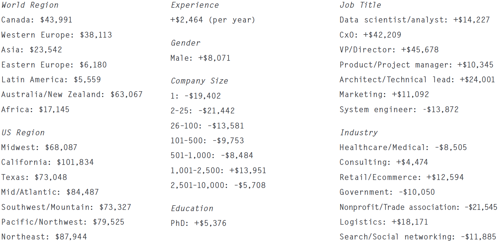
</div>

<div style="width:100%; text-align:center; font-size: 0.6em">
[source: www.oreilly.com/data/free/2017-data-science-salary-survey.csp]
</div>


## Association rules

<div style="float: left; width: 600px">
- Ideas come from market basket analysis
- What products are frequently bought together?
- How should shelves be managed?
- What impact does the discontinuation of a product have on the sales of other products? 
</div>

<div style="float: right">

</div>

<div style="clear: both">
**Goal:** Find frequent/interesting patterns, associations, correlations among sets of items
in a transactional database
</div>


## Association Rules -- Marketing & sales promotion

- Let the rule discovered be:  
  {Bagels} &rarr; {Potato chips}
- Potato chips as **consequent**  
  &rarr; Determine what should be done to boost its sales
- Bagels in the **antecedent**  
  &rarr; Which products would be affected if the store discontinues selling bagels


## Association Rules -- Shelf management

- Goal: Identify items that are bought together by many customers
- Approach: Process the point-of-sale data collected find groups of items frequently bought together
- Classic rule in literature:  
  If a customer buys diaper and milk, then he is very likely to buy beer


## Clustering

- **Task:** Given a set of data points and a similarity measure among them, find clusters such that
    - Data points in same cluster are more similar to one another
    - Data points in separate clusters are less similar to one another
- **Similarity Measures:**
    - Euclidean distance (continuous attributes)
    - Problem-specific measures


## Clustering -- Principle

#### Example: Assume we are given the following records 
<div style="text-align:center">
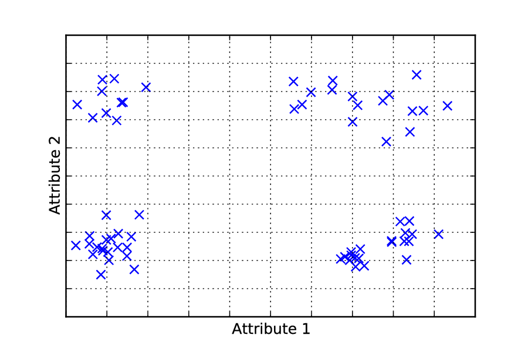
</div>


## Clustering -- Principle

#### We could group the records into 4 different clusters...
<div style="text-align:center">
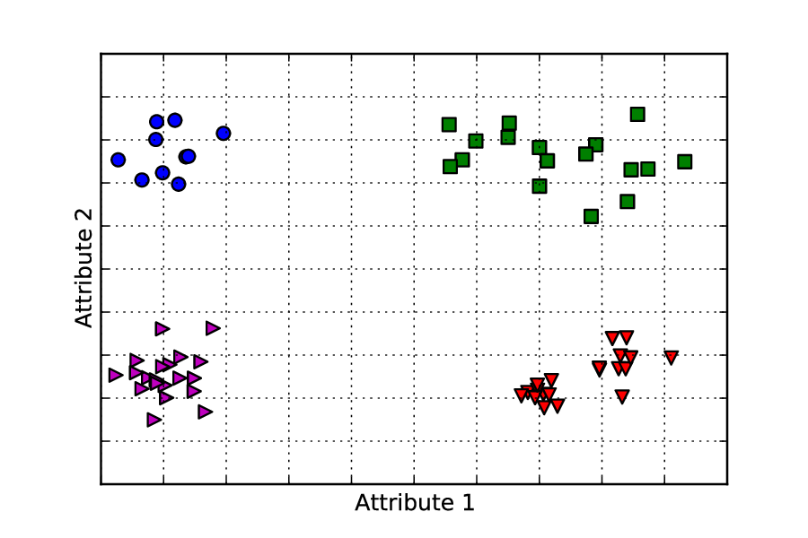
</div>


## Clustering -- Principle

#### ... or into 5 clusters
<div style="text-align:center">
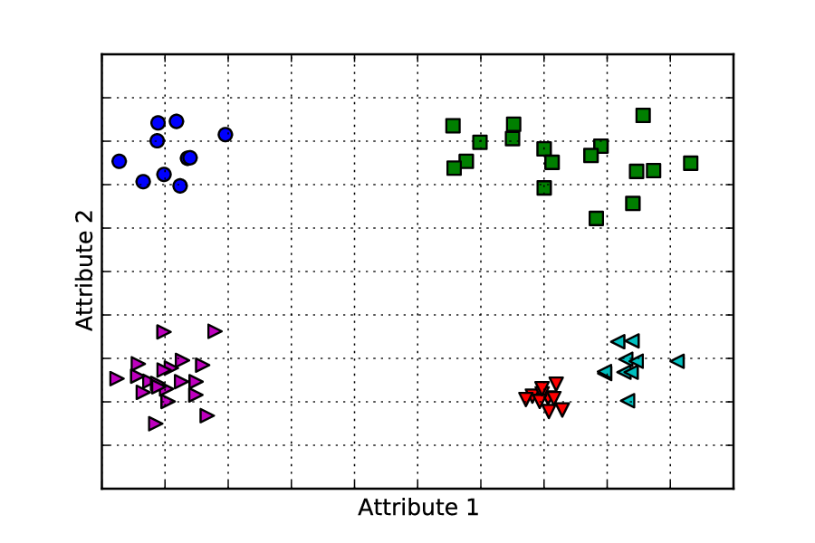
</div>


## Clustering -- Market segmentation

- **Goal:** Subdivide a market into distinct subsets of customers 
  where any subset may conceivably be selected as a market target
- Approach:
    - Collect different attributes of customers based on their geographical and lifestyle related information
    - Find clusters of "similar" customers
    - Measure the clustering quality by observing buying patterns of customers in same cluster vs. 
      those from different clusters


## Recommending

- Estimate a **utility function** that **predicts** how a user will **like** an item
- Estimation based on:  
  past behaviour, relations to other users, item similarity, context

<div style="text-align:center">
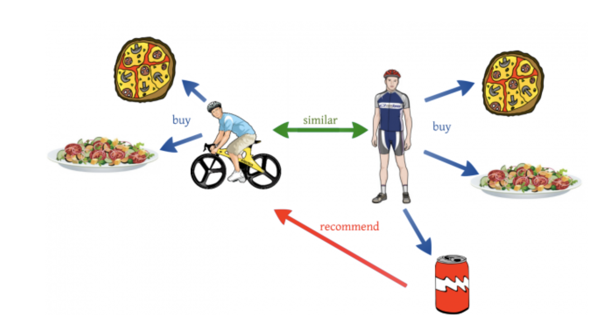
</div>

<div style="text-align:center; font-size: 0.6em; width: 100%">
[source: towardsdatascience.com]
</div>


## Recommending -- Online retail products

- **Goal:** Suggest products to the user of an online retail store to increase sales
- Approach:
    - Identify **similar users** based on their past purchase behaviour  
      &rarr; recommend their purchases  
    - Recommend **similar products** that a user has purchased in the past
    - If purchase history not available, recommend best-selling products 


# How does ML work?


## Lots of confusion about what ML is...

<div style="text-align:center">

</div>

<div style="text-align:center; font-size: 0.6em; width: 100%; margin-top: -20px">
[source: xkcd.com]
</div>


## Machine learning example -- Decision trees

- Decision tree learning is a method for approximating discrete-valued target functions, 
  in which the learned function is represented as a decision tree
- Decision tree representation:
    - Each internal node tests an attribute
    - Each branch corresponds to attribute value or range
    - Each leaf node assigns a classification


## Toy example -- Tennis data set 

```{r}
d_tree <- read.csv("assets/material/decision-tree-classification.csv")

d_tree %>% 
  select(play, everything()) %>% 
  knitr::kable()
```


## Decision tree -- Root node "outlook"

<div style="text-align:center">
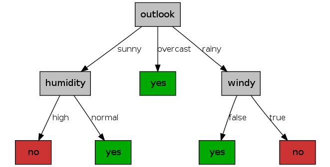
</div>


## Decision tree -- Root node "humidity"

<div style="text-align:center">
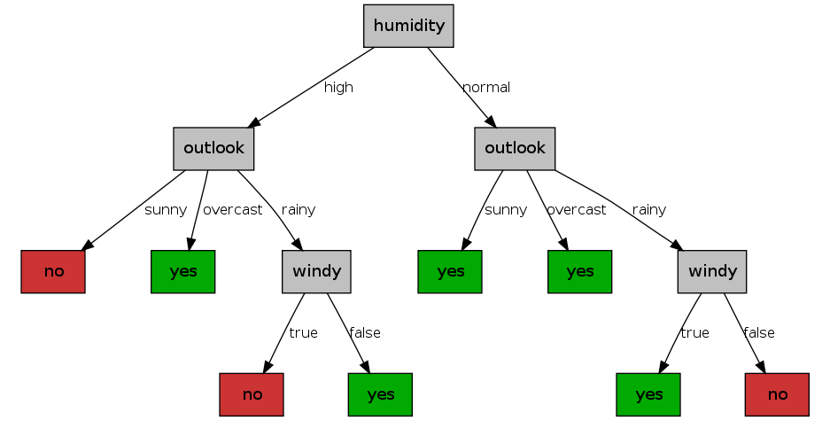
</div>

#### Which decision tree is more practical?


## Creating decision trees

### What is the best attribute to create a split?

- Heuristic: Choose attribute producing "purest" nodes
- Purity criterion for splitting: information gain
- Information gain increases with average purity of subsets that an attribute produces

&rarr; Strategy: Choose attribute that results in greatest information gain


## Information gain -- Entropy

- Entropy $H(X)$ of a random variable $X$ with possible values $\{x_1, \dots, x_k\}$ is defined as:
  $$H(X) = - \sum_{i=1}^{k}p_i \log_2 p_i $$  
  with $p_i = P(X = x_i)$
- Usually use logarithm of base 2 for entropy &rarr; unit of entropy is **bit**


## Tennis data set -- Sorted by "play" 

```{r}
d_tree <- read.csv("assets/material/decision-tree-classification.csv")

d_tree %>% 
  select(play, everything()) %>% 
  arrange(play) %>% 
  knitr::kable()
```


## Information gain -- Entropy of variable "play"

- Let's assume the attribute $\mbox{play}$ of the tennis data is a random variable 
  with the two outcomes $\{\text{no}, \text{yes}\}$
- Entropy of $\mbox{play}$ is defined as 
  $$H(\mbox{play}) = - (p_{\text{no}} \log_2 p_{\text{no}} + p_{\text{yes}} \log_2 p_{\text{yes}})$$
- \# of samples where $play = no$ is 5 out of 14  
  &rarr; $p_{\text{no}} = 5/14$
- \# of samples where $play = yes$ is 9 out of 14  
  &rarr; $p_{\text{yes} }= 9/14$
- $H(\mbox{play}) = - (5/14 \times \log_2 5/15 + 9/14 \times \log_2 9/14 ) = 0.94$


## Information gain -- Definition

- Let $T$ be a set of training samples
- Partition $T$ into disjoint exhaustive subsets $T_1 , \dots , T_k$
  on basis of the $k$ values of categorical attributes $S$
- Information gain is then defined as  
$$
\mbox{gain}(S, T) = H(T) - \sum_{i=1}^{k} \frac{|T_i|}{|T|} H(T_i)
$$
- **Strategy to build minimal tree:**  
  Choose attribute $S$ resulting in greatest information gain


## Tennis data set -- Sorted by "outlook" 

```{r}
d_tree <- read.csv("assets/material/decision-tree-classification.csv")

d_tree %>% 
  select(play, everything()) %>% 
  arrange(outlook, play) %>% 
  knitr::kable()
```


## Information gain for variable "outlook"

Let’s choose $S=\mbox{outlook}$ and compute $\mbox{gain}(\mbox{outlook},T)$:
$$
  \begin{eqnarray}
    \mbox{gain}(\mbox{outlook},T) & = & H(T) - \sum_{i \in \{\textsf{sun,overcast,rain}\} } \frac{|T_i|}{|T|} H(T_i) \nonumber \\
    & = & H(T) -  \\
    &   & \Bigl( \frac{5}{14} \times \Bigl( -\Bigl(\frac{2}{5} \times \log_2 \frac{2}{5} + \frac{3}{5} \times \log_2 \frac{3}{5} \Bigr) \Bigr) + \nonumber \\
    & & \ \ \frac{4}{14} \times \Bigl( −\Bigl( \frac{0}{4} \times \log_2 \frac{0}{4} + \frac{4}{4} \times \log_2 \frac{4}{4} \Bigr) \Bigr) + \nonumber \\
    & & \ \  \frac{5}{14} \times \Bigl( −\Bigl( \frac{3}{5} \times \log_2 \frac{3}{5} + \frac{2}{5} \times \log_2 \frac{2}{5} \Bigr) \Bigr) \Bigr) \nonumber \\
    & = & 0.94 - (0.347 + 0 + 0.347) \nonumber \\
    & = & 0.247 \nonumber
  \end{eqnarray}
$$

## Information gain for other variables

Compute gain for all attributes:

$\mbox{gain}(\mbox{outlook}, T) = 0.247$

$\mbox{gain}(\mbox{temp}, T) = 0.029$

$\mbox{gain}(\mbox{humidity}, T ) = 0.152$

$\mbox{gain}(\mbox{windy}, T ) = 0.048$

&rarr; Choose attribute corresponding to maximum gain for splitting: "outlook"


## Continuing the split

<div style="text-align:center">
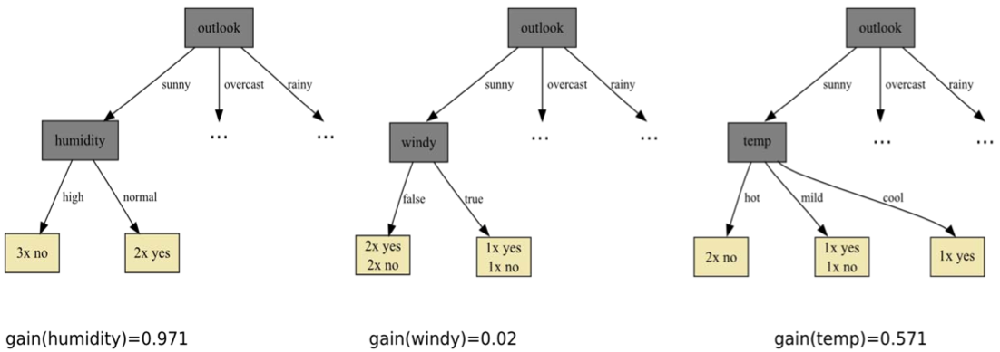
</div>


## Final tree

<div style="text-align:center">

</div>


## Few notes on decision trees

- Algorithm can create over-complex trees that do not generalize very well  
  &rarr; Mechanisms such as pruning are necessary to avoid this problem
- Trees can be extended to process numerical and missing attributes
- Trees can also solve regression problems 
- Construction of trees is computationally very efficient  
  &rarr; Popular choice for boosting and bagging approaches


## Summary

- Data science is an interdisciplinary field that uses scientific methods, 
  processes, algorithms and systems to extract knowledge and insights from data 
- Machine learning is a computer program that improves its performance on a task through experience (data)
- Classification, regression, association rules, clustering and recommendations are typical ML problems
- Decision trees as an example machine learning algorithm


# Questions?
