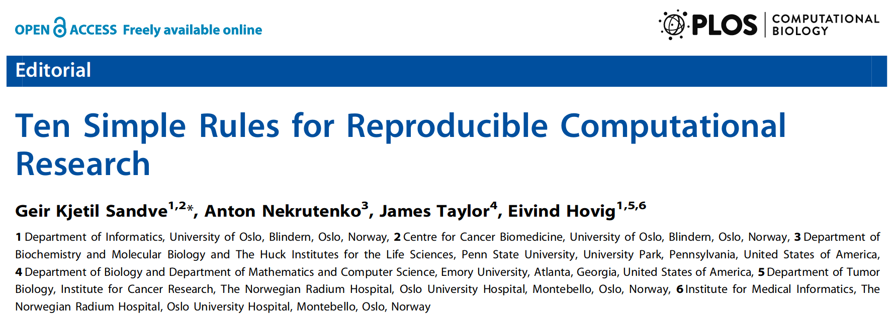

```{r setup, include=FALSE, warning=FALSE, message=FALSE, error=FALSE}
knitr::opts_chunk$set(
  echo = FALSE,
  fig.width=8, fig.height=3.8,
  fig.align="center",
  dpi=120
)

```


## Overview

- Data Science workflow
- Example analysis
- Reproducible Data Science


# Data Science workflow


## Data Science workflow

```{r out.width="100%"}
knitr::include_graphics("assets/img/data-science.png")
```

<div style="font-size: 0.8em; text-align:right; width: 100%">
[source: Wickham, Grolemund, "R for Data Science", 2017]
</div>


## Data analysis walk-through

<div style="float: left; width: 75%">
- Demonstration uses statistical programming language R
- Widely used in data science
- Strong emphasis on interactive, in-memory analysis
- Large community
- More than 10,000 packages covering most data science related aspects
</div>

<div style="float: right; text-align: right">

</div>


# Reproducible Data Science


## What is reproducibility?

<div style="text-align: center; font-size: 1.2em; padding-bottom: 50px">
"Two honest researchers would get the same result"

<div style="font-size: 0.8em; width: 100%">
-- John Mount
</div>
</div>

>- Transparent data sourcing
>- Automated analysis pipeline (code)
>- Tracebility from published results back to data

<div style="font-size: 0.8em; text-align: center; width: 100%; margin-top: 150px">
[source: David Smith, "Reproducible Data Science with R", 2017]
</div>


## Transparent data sourcing

>- Variety of data sources  
  (database, spreadsheets, logs, data files, APIs, web scraping, ...)
>- Snapshot data into local files  
  &rarr; document data retrieval and all ETL steps (ideally through code)
>- Conduct actual analysis based on local data  
  &rarr; reproducible analysis works off the same data 


## Analysis

>- Capture entire analysis process in computer programs (scripts)
>- Generate artifacts (figures, tables, numbers) using scripts 
>- Carefully document any manual steps required to reproduce analysis


## Reproducible analysis environment

>- Document used analytical software libraries and their versions
>- Organize work into independent directories (projects)
>- Only use relative paths in scripts
>- Set explicit random seeds
>- Use containers for production environment


## Presenting results

>- Eliminate manual processes (as far as possible)
>- Notebooks combine executable code chunks with documentation 
>- Document (slides, report, website) generation  
   &rarr; e.g. Rmarkdown, Jupyter Notebooks


## Collaboration 

>- Version control environment, analysis scripts and documentation
>- Store used local data files (e.g. Dropbox, network drive or database)
>- Make code updates painless (e.g. continuous integration, bash script)


## Further reading

```{r out.width="100%"}

```

<div style="text-align: right; font-size: 0.6em">
[link to source](http://journals.plos.org/ploscompbiol/article/file?id=10.1371/journal.pcbi.1003285&type=printable)
</div>


# Questions?
